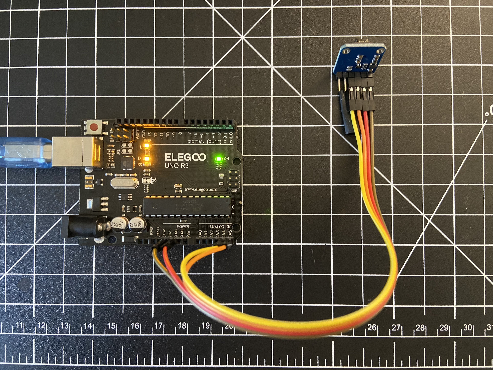
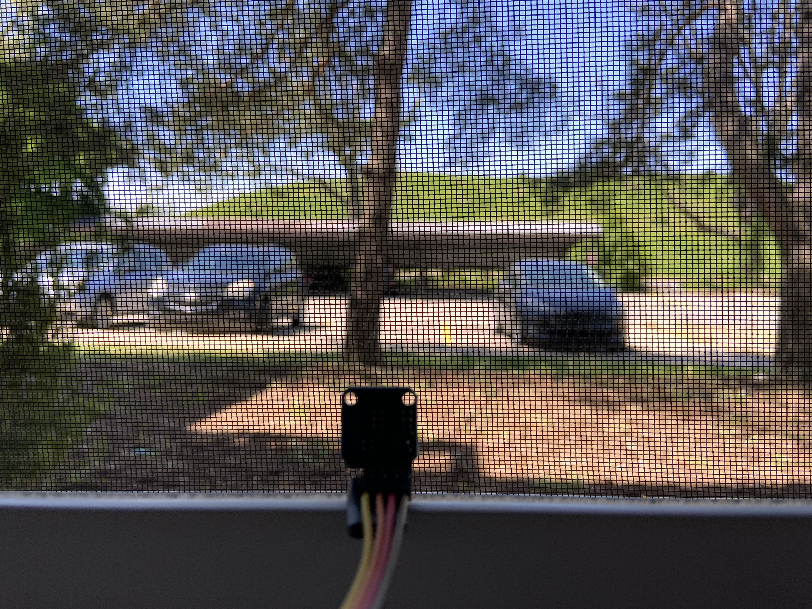
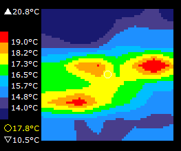
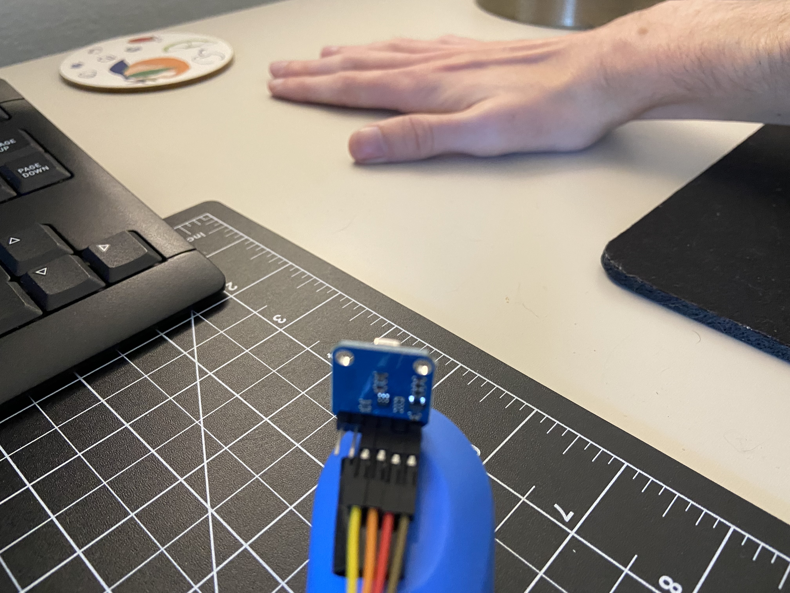
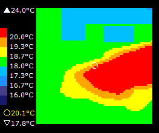

# Arduino Thermal Camera with Panasonic AMG8833 Grid-EYE

This project utilizes the Virtual Panel library created by Jaap Daniëlse and the Melopero AMG8833 library to create a thermal camera with the Panasonic AMG8833 Grid-EYE camera. The camera is programmed with an Arduino UNO R3. 

## Features

- Real-time thermal imaging
- Adjustable color scale
- Temperature data retrieval
- Easy-to-use interface with Virtual Panel

## Components

- Arduino UNO R3
- Panasonic AMG8833 Grid-EYE camera
- Jumper wires

## Documentation: 

#### Scene 1

#### Scene 2

## Credits

- [Virtual Panel Library](https://github.com/JaapDanielse/VirtualPanel/wiki): Developed by Jaap Daniëlse
- [Melopero AMG8833 Library](https://github.com/melopero/Melopero_AMG8833_Arduino_Library)

## License

Copyright 2024 - William Legg

Permission is hereby granted, free of charge, to any person obtaining a copy of this software and associated documentation files (the “Software”), to deal in the Software without restriction, including without limitation the rights to use, copy, modify, merge, publish, distribute, sublicense, and/or sell copies of the Software, and to permit persons to whom the Software is furnished to do so, subject to the following conditions:

The above copyright notice and this permission notice shall be included in all copies or substantial portions of the Software.

THE SOFTWARE IS PROVIDED “AS IS”, WITHOUT WARRANTY OF ANY KIND, EXPRESS OR IMPLIED, INCLUDING BUT NOT LIMITED TO THE WARRANTIES OF MERCHANTABILITY, FITNESS FOR A PARTICULAR PURPOSE AND NONINFRINGEMENT. IN NO EVENT SHALL THE AUTHORS OR COPYRIGHT HOLDERS BE LIABLE FOR ANY CLAIM, DAMAGES OR OTHER LIABILITY, WHETHER IN AN ACTION OF CONTRACT, TORT OR OTHERWISE, ARISING FROM, OUT OF OR IN CONNECTION WITH THE SOFTWARE OR THE USE OR OTHER DEALINGS IN THE SOFTWARE.